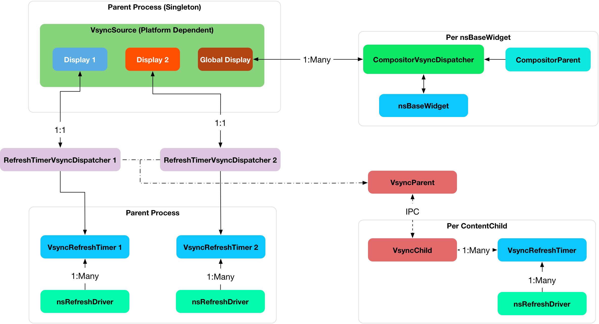

Silk Architecture Overview
=================

#Architecture
Our current architecture is to align three components to hardware vsync timers:

1. Compositor
2. RefreshDriver / Painting
3. Input Events

The flow of our rendering engine is as follows:

1. Hardware Vsync event occurs on an OS specific *Hardware Vsync Thread* on a per monitor basis.
2. For every Firefox window on the specific monitor, notify a **VsyncDispatcher**. The **VsyncDispatcher** is specific to one window.
3. The **VsyncDispatcher** will notify the **Compositor** that a vsync has occured.
4. The **VsyncDispatcher** will then notify the **RefreshDriver** that a vsync has occured.
5. The **Compositor** composites on the *Compositor Thread*, then dispatches input events after a composite.
6. The **RefreshDriver** paints on the *Main Thread*.

The implementation broken into the following sections and will reference this figure. Note that **Objects** are bold fonts while *Threads* are italicized.

#Hardware Vsync
Hardware vsync events from (1), occur on a specific **Display** Object.
The **Display** object manages and is responsible for enabling / disabling vsync on a per connected display basis.
For example, if two monitors are connected, two **Display** objects will be created, each listening to vsync events for their respective displays.
We require one **Display** object per monitor as each monitor may have different vsync rates or timers.
As a fallback solution, we have one global **Display** object that can synchronize across all connected displays.
The global **Display** is useful if a window is positioned halfway between the two monitors.
Each platform will have to implement a specific **Display** object to hook and listen to vsync events.
As of this writing, both Firefox OS and OS X create their own hardware specific *Hardware Vsync Thread* that executes after a vsync has occured.
OS X creates one *Hardware Vsync Thread* per **CVDisplayLinkRef**.
We create one **CVDisplayLinkRef** per **Display**, thus two **Display** objects will have two independent *Hardware Vsync Threads*.

All **Display** objects are encapsulated in a **Vsync Source** object.
The **VsyncSource** object lives in **gfxPlatform** and is instantited only on the parent process when **gfxPlatform** is created.
The **VsyncSource** is destroyed when **gfxPlatform** is destroyed.
There is only one **VsyncSource** object throughout the entire lifetime of Firefox.
Each platform is expected to implement their own **VsyncSource** to manage vsync events.
On Firefox OS, this is through the **HwcComposer2D**.
On OS X, this is through **CVDisplayLinkRef**.
On Windows, it should be through **WaitForVBlank**.

\subsectionMultiple Displays
The **VsyncSource** should have an API to switch a **VsyncDispatcher** from one **Display** to another **Display**.
For example, when one window either goes into full screen mode or moves from one connected monitor to another.
When one window moves to another monitor, we expect a platform specific notification to occur.
The detection of when a window enters full screen mode or moves is not covered by Silk itself, but the framework is built to support this use case.
The expected flow is that the OS notification occurs on **nsIWidget**, which retrieves the associated **VsyncDispatcher**.
The **VsyncDispatcher** then notifies the **VsyncSource** to switch the correct **Display** the **VsyncDispatcher** is connected to.
Because the notification works through the **nsIWidget**, the actual switching of the **VsyncDispatcher** to the correct **Display** should occur on the *Main Thread*.

#Compositor
Compositor

#Touch Inputs
Touch here

#Refresh Driver

\subsectionFirefox OS
Here we go

\subsectionE10s
Silk with e10s

#Object Lifetime
Object lifetime

#Threads
1. Compositor Thread
2. Main Thread
3. PBackground Thread
4. Hardware Vsync Thread

#Gaming

#Performance
Vsync Timers

